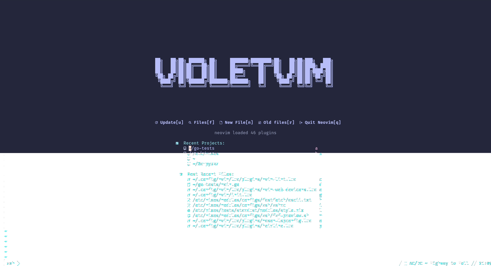
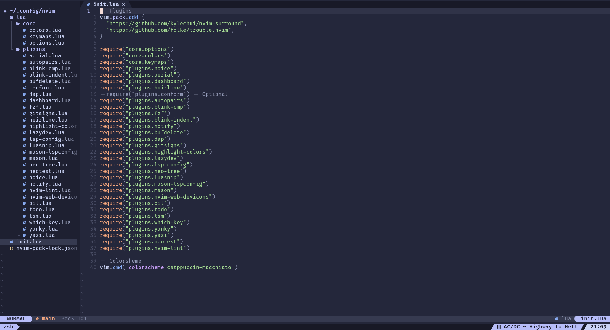
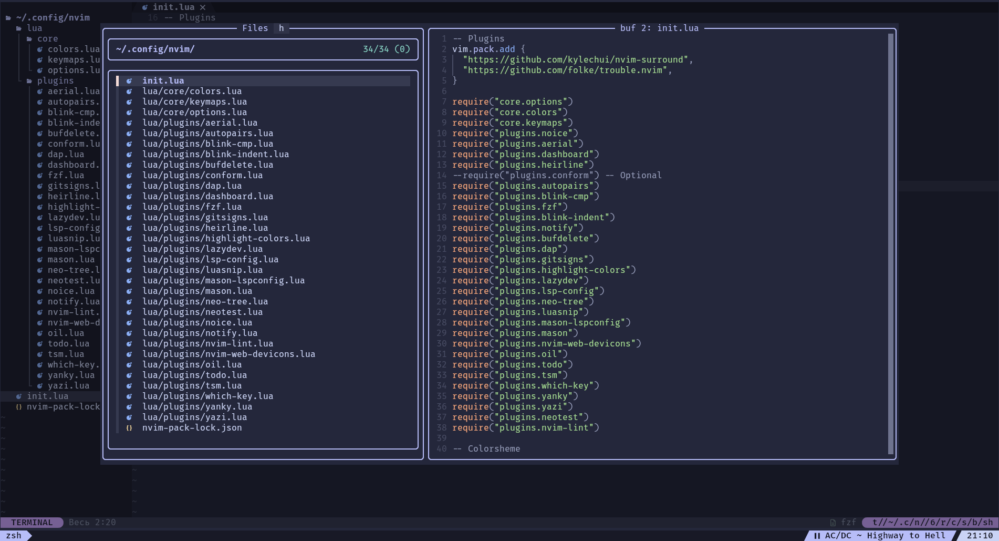
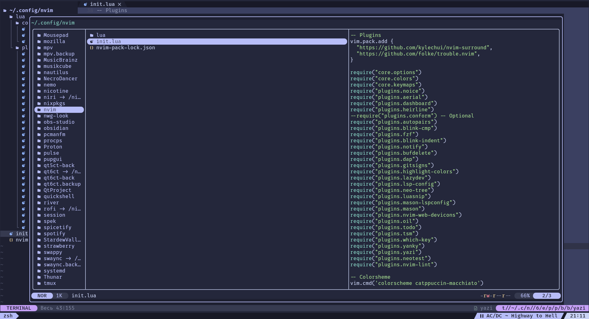

# VioletVim
If you actually like this, then my condolences.

---

  
  
  
  

---

## Requirements:

Neovim 0.12+,

git,

tree-sitter CLI,

yazi (My config see [here](https://github.com/BurntSushi/ripgrep#installation)),

clang *or* gcc,

fzf,

ueberzugpp,

rg,

fd,

Nerd Fonts (FiraCode in the screenshot)

---

## Install:

TODO
