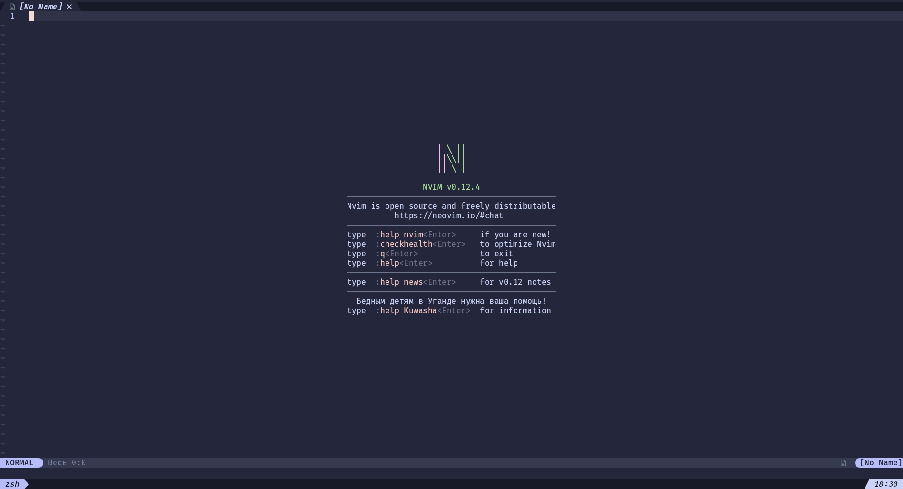
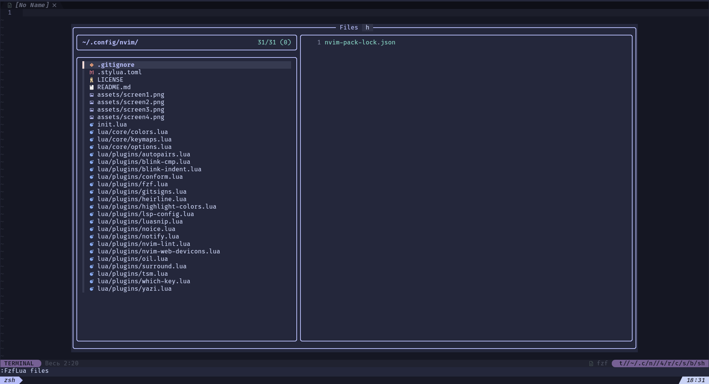
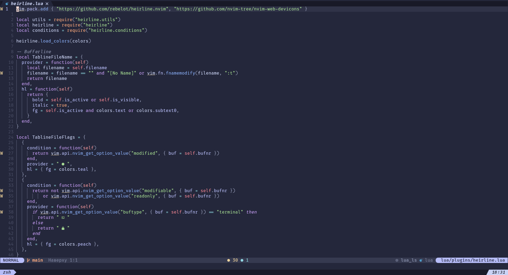
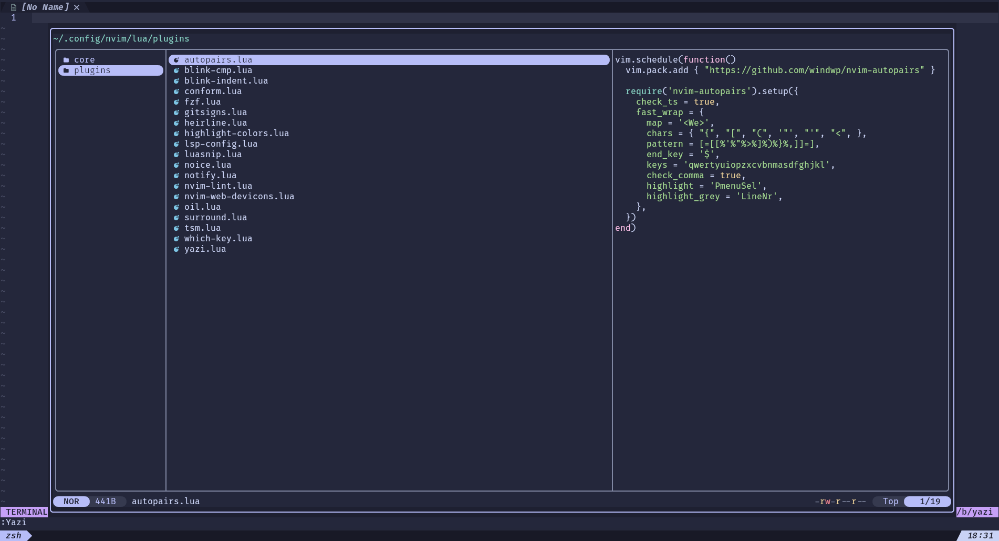

# <p align="center"> VioletVim

<p align="center">
  
  
  
  
</p>

## Requirements:

- [Neovim 0.12+](https://neovim.io/)

- [git](https://git-scm.com/)

- [tree-sitter CLI](https://tree-sitter.github.io/tree-sitter/)

- [yazi](https://yazi-rs.github.io/) (Optional, my config see [here](https://github.com/L0rdDioBrando/violet-dots/tree/main/nixos/home-manager/configs/yazi))

- [clang](https://clang.llvm.org/) *or* [gcc](https://gcc.gnu.org/)

- [fzf](https://github.com/junegunn/fzf)

- [rg](https://github.com/burntsushi/ripgrep)

- [zoxide](https://github.com/ajeetdsouza/zoxide)

- [fd](https://github.com/sharkdp/fd)

- [Rust toolchain](https://rustup.rs/)

- [Nerd Font](https://www.nerdfonts.com/) ([FiraCode](https://github.com/tonsky/firacode) in the screenshot)

## Install:

Backup your config:

```bash
mv ~/.config/nvim ~/.config/nvim.back
```
Install my dotfiles:

```bash
git clone https://github.com/L0rdDioBrando/VioletVim.git $HOME/.config/nvim
```

## Plugins:

- Package manager: [Pack](https://neovim.io/doc/user/pack/)

- Completion: [blink.cmp](https://github.com/saghen/blink.cmp)

- File managers: [oil.nvim](https://github.com/stevearc/oil.nvim) & [yazi.nvim](https://github.com/mikavilpas/yazi.nvim)

- Find files: [fzf-lua](https://github.com/ibhagwan/fzf-lua)

- Colorscheme: [catppuccin-macchiato](https://github.com/catppuccin/nvim)

- Statusline & bufferline: [heirline.nvim](https://github.com/rebelot/heirline.nvim)

- Pairs: [nvim-autopairs](https://github.com/windwp/nvim-autopairs)

- Git integration: [gitsigns.nvim](https://github.com/lewis6991/gitsigns.nvim)

- Formatters, LSP & Linters: [conform.nvim](https://github.com/stevearc/conform.nvim), [nvim-lspconfig](https://github.com/neovim/nvim-lspconfig) & [nvim-lint](https://github.com/mfussenegger/nvim-lint)

- Indent: [blink.indent](https://github.com/saghen/blink.indent)

- Snippets: [LuaSnip](https://github.com/L3MON4D3/LuaSnip)

- Highlighting: [nvim-treesitter](https://github.com/nvim-treesitter/nvim-treesitter)

- Colors highlight: [nvim-colorizer.lua](https://github.com/catgoose/nvim-colorizer.lua)

- Others:
  - [nvim-web-devicons](https://github.com/nvim-tree/nvim-web-devicons)
  - [nvim-surround](https://github.com/kylechui/nvim-surround)
  - [which-key.nvim](https://github.com/folke/which-key.nvim)

## Structure:

```
.
├── assets
│   ├── screen1.png
│   ├── screen2.png
│   ├── screen3.png
│   └── screen4.png
├── init.lua
├── LICENSE
├── lua
│   ├── core
│   │   ├── colors.lua
│   │   ├── keymaps.lua
│   │   └── options.lua
│   └── plugins
│       ├── autopairs.lua
│       ├── blink-cmp.lua
│       ├── blink-indent.lua
│       ├── colorizer.lua
│       ├── conform.lua
│       ├── fzf.lua
│       ├── gitsigns.lua
│       ├── heirline.lua
│       ├── lsp-config.lua
│       ├── luasnip.lua
│       ├── nvim-lint.lua
│       ├── nvim-web-devicons.lua
│       ├── oil.lua
│       ├── surround.lua
│       ├── treesitter.lua
│       ├── which-key.lua
│       └── yazi.lua
├── nvim-pack-lock.json
└── README.md
```
